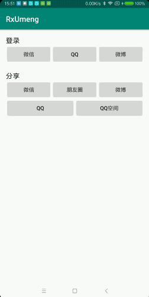

## 运行Demo
要运行Demo请查看[RunDemo.md](RunDemo.md)

## 友盟分享

### 截图


### 版本对应表
为了避免出现版本不一致导致的API调不到，请使用表中的版本

-|RxUmeng - Social|umsdk:common|umsdk:utdid|umsdk:share-*
:-:|:-:|:-:|:-:|:-:
对应版本|1.0.1|2.0.1|1.1.5.3|6.9.4

### Gradle引入
引入友盟SDK需要在根目录gradle加入友盟的仓库地址
 
```
allprojects {
    repositories {
        maven { url 'https://dl.bintray.com/umsdk/release' }
    }
}
```
```
//分享
implementation 'com.dyhdyh.rxumeng:rxumeng-social:1.0.1'

//友盟sdk基础组件
implementation 'com.umeng.umsdk:common:2.0.1'
implementation 'com.umeng.umsdk:utdid:1.1.5.3'

//友盟分享sdk
implementation 'com.umeng.umsdk:share-core:6.9.4'
implementation 'com.umeng.umsdk:share-wx:6.9.4'
implementation 'com.umeng.umsdk:share-qq:6.9.4'
implementation 'com.umeng.umsdk:share-sina:6.9.4'

//RxJava
implementation 'io.reactivex.rxjava2:rxjava:2.2.4'
implementation 'io.reactivex.rxjava2:rxandroid:2.1.0'

//AppCompat
implementation 'com.android.support:appcompat-v7:28.0.0'

```
### 配置
QQ需要在`build.gradle`配置一个占位以改变AndroidManifest中的appid

```
android {
    defaultConfig {
        manifestPlaceholders = [
                qqappid: "QQ APP ID",
        ]
    }
}
```

### 初始化
[基础组件初始化](https://developer.umeng.com/docs/66632/detail/66890#h2-u521Du59CBu53166)

```
public class MainApplication extends Application {

    @Override
    public void onCreate() {
        super.onCreate();

        //基础组件初始化
        String umengAppKey = BuildConfig.EXAMPLE_UMENG_KEY;
        UMConfigure.init(getApplicationContext(), umengAppKey, "Channel", UMConfigure.DEVICE_TYPE_PHONE, "");
        UMConfigure.setLogEnabled(BuildConfig.DEBUG);

        //分享sdk初始化
        RxUmengSocial.get().register(this, new UmengSocialRegisterCallback() {
            @Override
            public void onRegister() {
                //设置平台appid
                PlatformConfig.setWeixin(BuildConfig.EXAMPLE_WECHAT_APPID, BuildConfig.EXAMPLE_WECHAT_APIKEY);
                PlatformConfig.setQQZone(BuildConfig.EXAMPLE_QQ_APPID, BuildConfig.EXAMPLE_QQ_APPKEY);
                PlatformConfig.setSinaWeibo(BuildConfig.EXAMPLE_WEIBO_APPKEY, BuildConfig.EXAMPLE_WEIBO_APPSECRET, "http://sns.whalecloud.com/sina2/callback");
            }
        }, new UmengSocialResumeCallback() {
            @Override
            public void onResume(Context context) {
            	//调用分享的Activity的onResume生命周期回调
            	//Demo中是统一在这里处理了Loading的关闭
            }
        });
    }
}
```

### 在Activity中重写方法
```
    @Override
    protected void onResume() {
        super.onResume();
        RxUmengSocial.get().onResume(this);
    }

    @Override
    protected void onDestroy() {
        super.onDestroy();
        RxUmengSocial.get().onDestroy(this);
    }

    @Override
    protected void onActivityResult(int requestCode, int resultCode, @Nullable Intent data) {
        super.onActivityResult(requestCode, resultCode, data);
        RxUmengSocial.get().onActivityResult(this, requestCode, resultCode, data);
    }
```

### 第三方登录（RxJava）
```
//检查权限(没有会先申请)
if (!RxUmengSocial.get().hasPermissions(activity)) {
    return;
}
RxUmengSocial.get()
        .setShareMedia(shareMedia)
        .getPlatformInfo(activity)
        .subscribe(new Observer<UmengAuthResult>() {
            @Override
            public void onSubscribe(Disposable d) {
                LoadingDialog.make(MainActivity.this).show();
            }

            @Override
            public void onNext(UmengAuthResult result) {
                LoadingDialog.cancel();
                
                final int code = result.getCode();
                final Map<String, String> data = result.getData();
                final SHARE_MEDIA shareMedia = result.getShareMedia();
            }

            @Override
            public void onError(Throwable e) {
                LoadingDialog.cancel();
                
                if (e instanceof UmengPlatformInstallException) {
                    //没有安装需要的客户端的异常(微博可以用网页授权，所以微博不会检查)
                    Toast.makeText(MainActivity.this, "没有安装" + ((UmengPlatformInstallException) e).getShareMedia() + "客户端", Toast.LENGTH_SHORT).show();
                } else if (e instanceof UmengPlatformCancelException) {
                    //用户取消操作会回调这里
                    Toast.makeText(MainActivity.this, "取消登录", Toast.LENGTH_SHORT).show();
                } else {
                    //其它失败的异常
                    Toast.makeText(MainActivity.this, "登录失败", Toast.LENGTH_SHORT).show();
                }
            }

            @Override
            public void onComplete() {

            }
        });
```

### 分享
```
if (!RxUmengSocial.get().hasPermissions(this)) {
    return;
}
//如果关闭了自动检查 则需要手动检查平台是否可用
if (!RxUmengSocial.get().isPlatformAvailable(this, shareMedia)) {
    Toast.makeText(MainActivity.this, "没有安装" + shareMedia + "客户端", Toast.LENGTH_SHORT).show();
    return;
}
RxUmengSocial.get()
        .setShareMedia(shareMedia)
        //是否开启自动检查平台可用性 默认true
        .setCheckPlatform(false)
        //分享图片
        //.shareImage(activity, umImage)
        //分享URL
        .shareUrl(activity, title, content, umImage, url)
        .subscribe(new Observer<SHARE_MEDIA>() {
            @Override
            public void onSubscribe(Disposable d) {
                LoadingDialog.make(MainActivity.this).show();
            }

            @Override
            public void onNext(SHARE_MEDIA result) {
                LoadingDialog.cancel();

                //检查平台是否有成功事件
                if (UmengPlatformInfo.isHasShareSuccessEvent(result)) {
                    Toast.makeText(MainActivity.this, result + "分享成功", Toast.LENGTH_SHORT).show();
                }

            }

            @Override
            public void onError(Throwable e) {
                LoadingDialog.cancel();
                if (e instanceof UmengPlatformInstallException) {
                    Toast.makeText(MainActivity.this, "没有安装" + ((UmengPlatformInstallException) e).getShareMedia() + "客户端", Toast.LENGTH_SHORT).show();
                } else if (e instanceof UmengPlatformCancelException) {
                    Toast.makeText(MainActivity.this, "取消分享", Toast.LENGTH_SHORT).show();
                } else {
                    Toast.makeText(MainActivity.this, "分享失败", Toast.LENGTH_SHORT).show();
                }
            }

            @Override
            public void onComplete() {

            }
        });
```

### 关于微信分享的回调
>[微信团队 - 分享功能调整](https://mp.weixin.qq.com/cgi-bin/announce?action=getannouncement&announce_id=11526372695t90Dn&lang=zh_CN)
>
>6月份新版微信客户端发布后，不再返回用户是否分享完成事件，即原先的cancel事件和success事件将统一为success事件


## 系统分享
`RxSystemSocial`提供了用系统的方式来分享内容

```
RxSystemSocial.get()
        .setShareMedia(shareMedia)
        .setListener(new OnSystemSocialListener() {
            @Override
            public void onError(SHARE_MEDIA share_media, Throwable e) {
                if (e instanceof UmengPlatformInstallException) {
                    Toast.makeText(MainActivity.this, "没有安装" + share_media + "客户端", Toast.LENGTH_SHORT).show();
                } else if (e instanceof ActivityNotFoundException) {
                    //这个平台通过系统分享 分享不了这个内容
                    Toast.makeText(MainActivity.this, share_media + "不支持分享该内容", Toast.LENGTH_SHORT).show();
                } else {
                    Toast.makeText(MainActivity.this, "分享失败", Toast.LENGTH_SHORT).show();
                }
            }
        })
        //.startSystemShareFile(context, file)
        .startSystemShareText(context, "我只是个标题", "我也是只是个内容");
```

#### 分享文件的配置
如果需要分享文件，还需要配置`FileProvider`

在`AndroidManifest.xml`中添加`FileProvider`

```
<provider
    android:name="android.support.v4.content.FileProvider"
    android:authorities="${applicationId}.fileprovider"
    android:exported="false"
    android:grantUriPermissions="true">
    <meta-data
        android:name="android.support.FILE_PROVIDER_PATHS"
        android:resource="@xml/file_paths" />
</provider>
```
在`res`中创建`xml`文件夹，并创建`file_paths.xml`

```
<?xml version="1.0" encoding="utf-8"?>
<paths xmlns:android="http://schemas.android.com/apk/res/android">
    <root-path name="root_dir" path="" />
</paths>
```
### 平台工具
```
//获取所有支持平台的包名
final List<String> packageNames = UmengPlatformInfo.getPackageNames();

//获取指定平台的包名
final String packageName = UmengPlatformInfo.getPackageName(SHARE_MEDIA.WEIXIN);
final List<String> packageNames = UmengPlatformInfo.getPackageNames(SHARE_MEDIA.WEIXIN, SHARE_MEDIA.QQ);
```