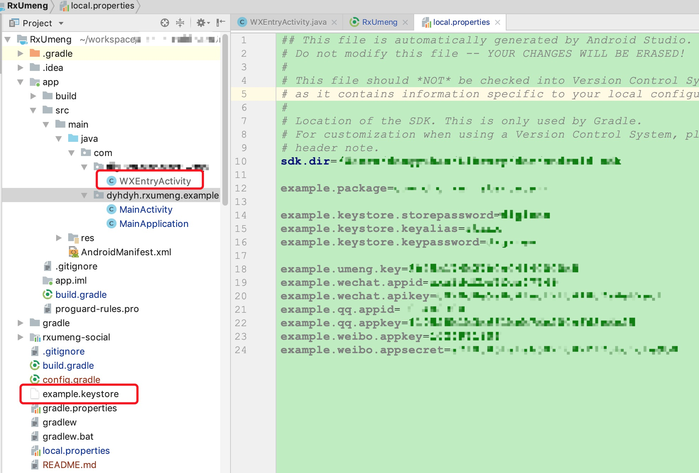

## 运行Demo
因为我没有可以公开的appkey，所以要运行Demo，需要先配置成你自己的信息，复制并填写应用的信息到`local.properties`

```
//应用包名
example.package=

//keystore信息
example.keystore.storepassword=
example.keystore.keyalias=
example.keystore.keypassword=

//开放平台信息
example.umeng.key=
example.wechat.appid=
example.wechat.apikey=
example.qq.appid=
example.qq.appkey=
example.weibo.appkey=
example.weibo.appsecret=
```

将你的keystore文件重命名为`example.keystore`放到工程根目录，在你的工程下面新建`应用包名.wxapi.WXEntryActivity`并继承`WXCallbackActivity `

```
import com.umeng.socialize.weixin.view.WXCallbackActivity;

public class WXEntryActivity extends WXCallbackActivity {

}
```

最终的工程应该是这样的

